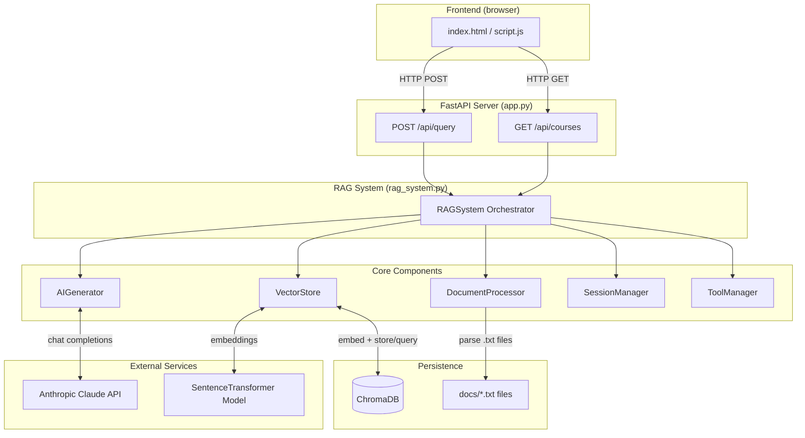
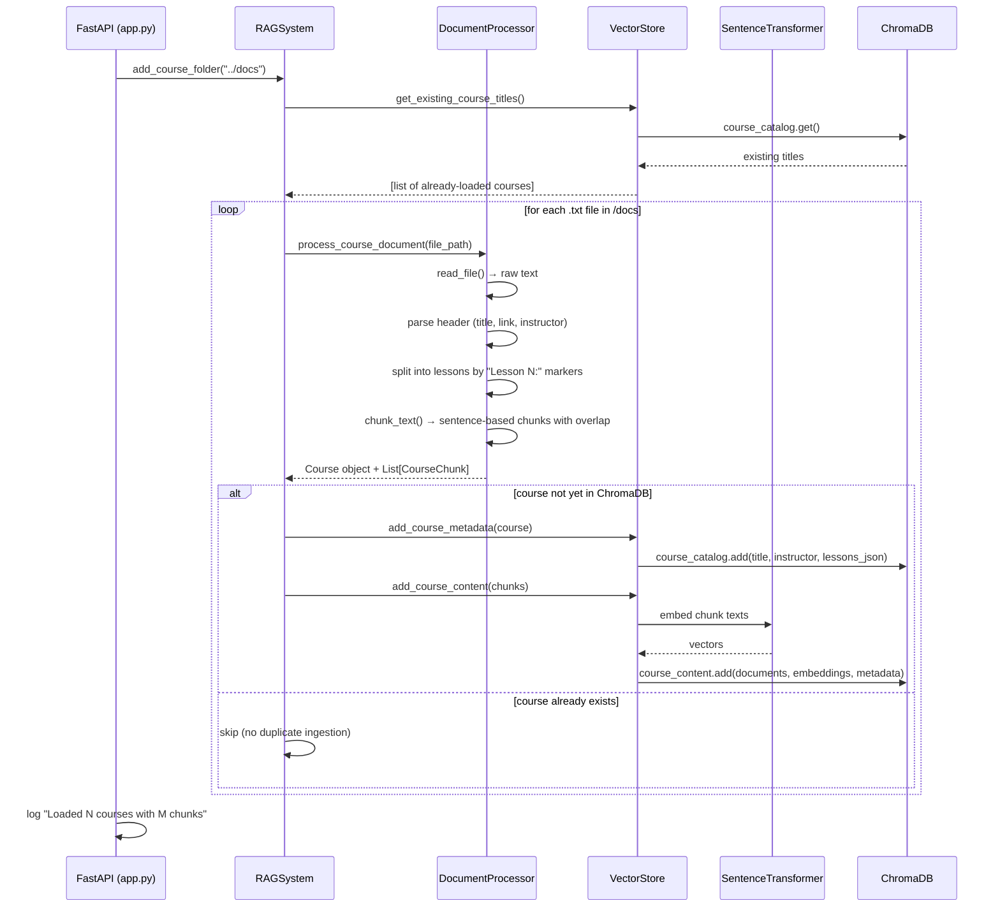
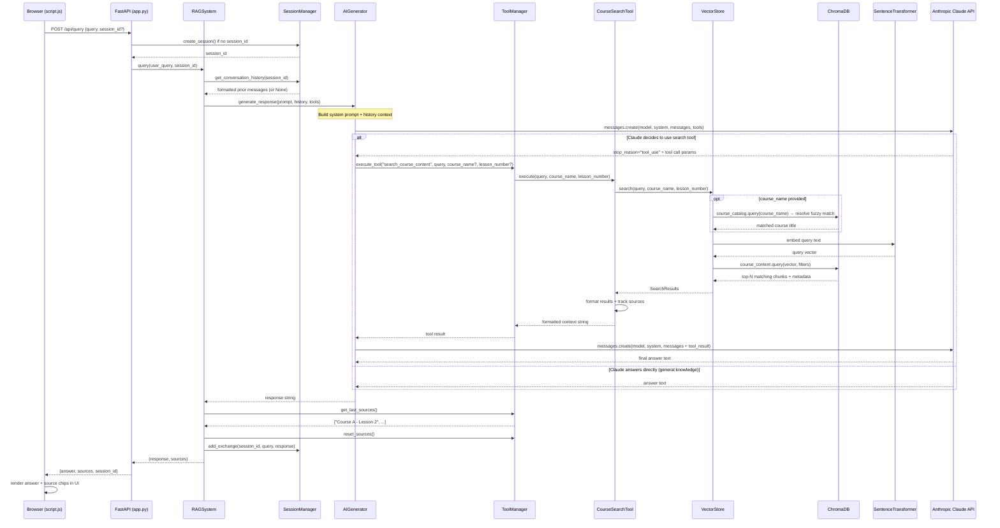
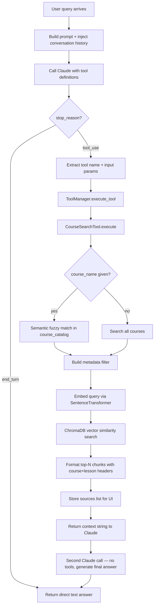

# Application Flow Diagram

## System Architecture Overview



---

## 1. Startup / Document Ingestion Flow

Runs once when the server starts (`@app.on_event("startup")`).



---

## 2. Query / Response Flow

Triggered on every `POST /api/query` from the user.



---

## 3. ChromaDB Collections Layout

The vector store uses two separate collections:

```
ChromaDB (persistent on disk)
│
├── course_catalog          ← one document per course
│   ├── id: "Course Title"
│   ├── document: "Course Title"   (used for fuzzy name resolution)
│   └── metadata:
│       ├── title
│       ├── instructor
│       ├── course_link
│       ├── lessons_json   (serialised array of lesson titles + links)
│       └── lesson_count
│
└── course_content          ← one document per chunk
    ├── id: "Course_Title_<chunk_index>"
    ├── document: "Lesson N content: ..."  (the actual text chunk)
    └── metadata:
        ├── course_title
        ├── lesson_number
        └── chunk_index
```

---

## 4. AI Tool Execution Loop (detail)


